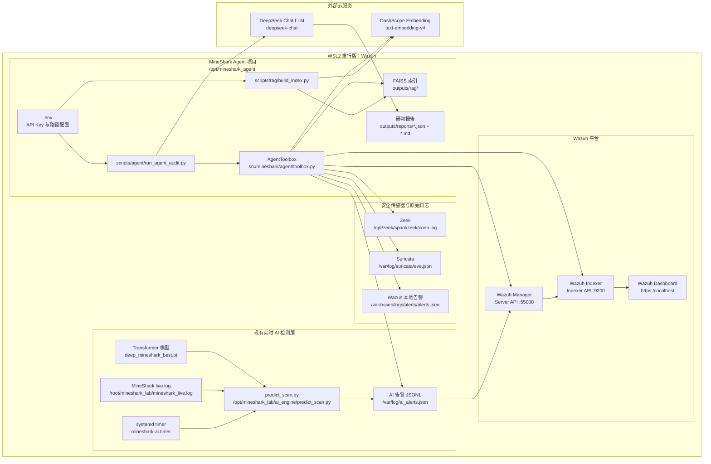
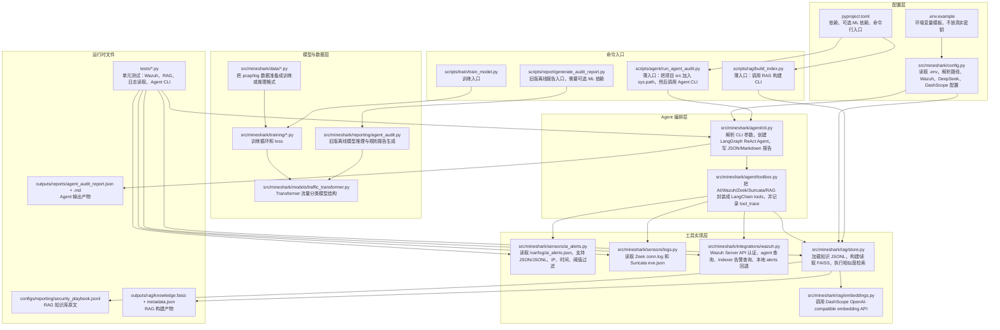
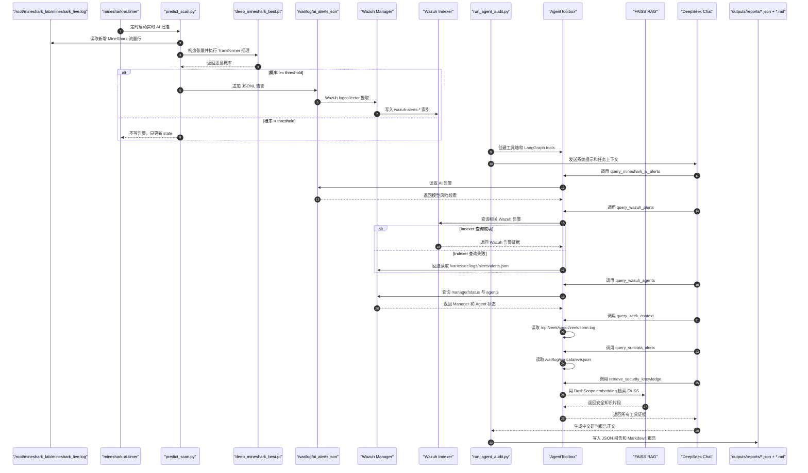

# MineShark 系统流程图

这份文档用于把 `demo_jianli` 分支从黑盒拆开。建议阅读顺序：

1. 先看“图 1：系统总览图”，理解 WSL Wazuh、MineShark AI、Wazuh、RAG、Agent 之间怎么连。
2. 再看“图 2：代码文件职责图”，理解每个关键文件在项目里做什么。
3. 最后看“图 3：一次完整研判数据流图”，理解一条 AI 告警如何变成最终中文报告。

## 图 1：系统总览图

这张图回答：整个系统有哪些组件，数据从哪里来，到哪里去。



### 图 1 怎么讲给面试官

这个项目采用旁路研判架构。原有实时检测链路不被替换：`mineshark-ai.timer` 定时调用 `/opt/mineshark_lab/ai_engine/predict_scan.py`，读取 MineShark live log，用 `deep_mineshark_best.pt` 推理，再把 AI 告警追加到 `/var/log/ai_alerts.json`。Wazuh 已经监听这个文件，所以 AI 告警会被 Wazuh 摄取并触发规则。

新增的 `demo_jianli` 分支代码位于 `/opt/mineshark_agent`。它不写回 Wazuh，不做自动封禁，只读取 AI 告警、Wazuh API、Wazuh Indexer、Zeek、Suricata 和本地 RAG 索引，然后交给 DeepSeek + LangGraph Agent 生成中文研判报告。

## 图 2：代码文件职责图

这张图回答：项目里每个关键文件干什么，被谁调用。



### 关键文件职责表

| 文件 | 主要职责 | 输入 | 输出 | 被谁调用 |
|---|---|---|---|---|
| `pyproject.toml` | 定义包名、依赖、可选 ML 依赖和命令行入口 | 无 | `mineshark-agent-audit`、`mineshark-build-rag` 等入口 | `pip install -e .` |
| `.env.example` | 提供环境变量模板 | 无 | `.env` 的填写参考 | 人工复制 |
| `src/mineshark/config.py` | 读取 `.env`，把字符串配置转成 `RuntimeConfig` | `.env`、环境变量 | 路径、API URL、密钥、TLS 配置 | Agent CLI、RAG CLI、Wazuh/RAG 工具 |
| `scripts/rag/build_index.py` | RAG 构建脚本入口 | CLI 参数 | 调用 `mineshark.rag.build_index.main()` | 人工执行 |
| `src/mineshark/rag/build_index.py` | 加载知识库，调用 embedding，构建 FAISS | `security_playbook.jsonl`、`.env` | `outputs/rag/knowledge.faiss`、`metadata.json` | `scripts/rag/build_index.py` |
| `src/mineshark/rag/embeddings.py` | 调用 DashScope 向量模型 | 文本列表、`DASHSCOPE_API_KEY` | 向量列表 | RAG 构建与检索 |
| `src/mineshark/rag/store.py` | 管理知识记录、FAISS 建库和检索 | 知识 JSONL、query 文本 | 相似知识片段 | RAG CLI、Agent 工具箱 |
| `scripts/agent/run_agent_audit.py` | Agent 脚本入口 | CLI 参数 | 调用 `mineshark.agent.cli.main()` | 人工执行 |
| `src/mineshark/agent/cli.py` | 创建 LangGraph ReAct Agent，组织输入，写报告 | `.env`、CLI 参数、工具箱 | `agent_audit_report.json`、`.md` | Agent 脚本/命令行 |
| `src/mineshark/agent/toolbox.py` | 把各数据源封装成工具，并记录 `tool_trace` | RuntimeConfig、工具参数 | 结构化工具结果 | LangGraph Agent |
| `src/mineshark/sensors/ai_alerts.py` | 读取实时 AI 告警，支持 JSON/JSONL 和阈值过滤 | `/var/log/ai_alerts.json` | `alerts`、`matched`、`empty` | `query_mineshark_ai_alerts` 工具 |
| `src/mineshark/sensors/logs.py` | 读取 Zeek/Suricata 日志 | `conn.log`、`eve.json` | Zeek events、Suricata alerts | Agent 工具箱 |
| `src/mineshark/integrations/wazuh.py` | 对接 Wazuh Server API 与 Indexer API，失败时读本地 alerts | Wazuh API、Indexer API、本地 alerts | manager 状态、agents、alerts | Agent 工具箱 |
| `src/mineshark/reporting/agent_audit.py` | 旧版离线报告生成器，可选重新跑模型推理 | checkpoint、log 文件、知识库 | 旧版 JSON/Markdown 报告 | `mineshark-audit` 或 `--rerun-model` |
| `src/mineshark/models/traffic_transformer.py` | Transformer 模型结构 | 包长、方向、IAT 张量 | 分类 logits | 训练、旧版推理 |
| `src/mineshark/data/*.py` | 数据准备脚本 | pcap/log/数据集 | 训练或推理输入 | 数据处理命令 |
| `src/mineshark/training/*.py` | 模型训练逻辑 | 数据集、配置 | checkpoint | 训练入口 |
| `configs/reporting/security_playbook.jsonl` | 安全知识库 | 人工维护的 JSONL | RAG 记录 | RAG 构建 |
| `tests/*.py` | 单元测试 | mock HTTP、小日志、小知识库 | 测试结果 | `python -m unittest discover -v` |

## 图 3：一次完整研判数据流图

这张图回答：一条 MineShark AI 告警如何变成最终报告。



### 图 3 对应我们已经跑通的实验

本次受控实验里，`/var/log/ai_alerts.json` 中生成了一条真实模型推理告警：

```json
{
  "engine": "deep_mineshark",
  "alert_type": "MineShark_Encrypted_Detection",
  "prediction": "Malware",
  "ai_confidence": 0.999951,
  "threshold": 0.5,
  "uid": "lab_replay_mineshark_20260527063525",
  "src_ip": "104.18.27.120",
  "src_port": 443,
  "dst_ip": "192.168.30.152",
  "dst_port": 57458,
  "proto": "tcp"
}
```

Wazuh 摄取后触发了规则：

```text
rule.id = 100500
rule.level = 12
rule.description = MineShark AI detected malicious encrypted traffic
location = /var/log/ai_alerts.json
```

Agent 报告生成后写入：

```text
/opt/mineshark_agent/outputs/reports/agent_audit_report.json
/opt/mineshark_agent/outputs/reports/agent_audit_report.md
```

## 当前系统边界

- Agent 默认读取 `/var/log/ai_alerts.json`，不重新跑模型。
- 只有加 `--rerun-model` 时，才会启用旧版 Transformer 推理工具。
- Agent 只读 Wazuh、Zeek、Suricata、RAG，不写回 Wazuh。
- 模型概率只能作为风险线索，不能直接当作攻击事实。
- `WAZUH_VERIFY_SSL=false` 是本地自签名证书开发模式，正式环境要配置 CA 并开启校验。

